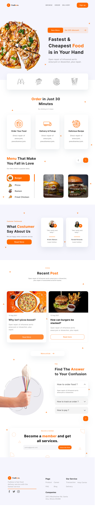
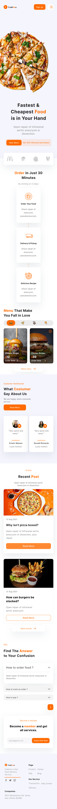
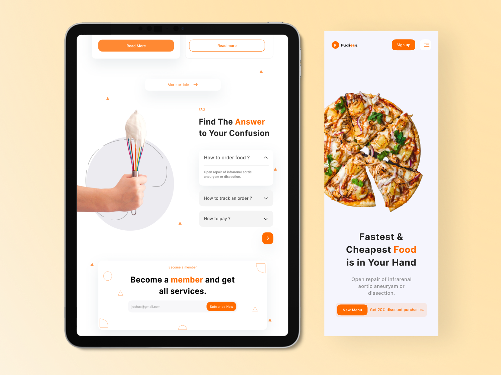
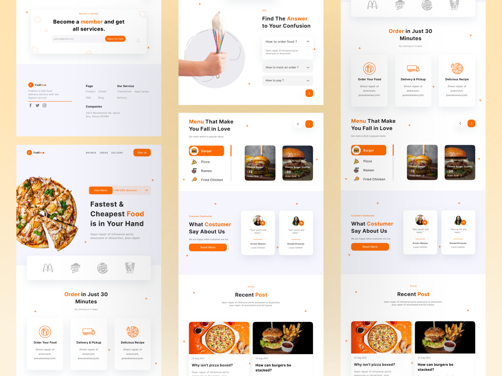

# Fudiess - Food delivery Mobile & Tablet Responsive App

## App Concept
App concept created and inspired by [Fudiess - Food delivery Mobile & Tablet Responsive.](https://dribbble.com/shots/16539854-Fudiess-Food-delivery-Mobile-Tablet-Responsive) design found on dribble.

## App Responsive
A nice clean Food Delivery App for Designer or developers.
Fudiess is a website that helps customers order food without having to leave the house, fudiess will deliver food after you order it from home.
We redesign the app also make it responsive so that you can run it everywhere on your phone, tab, or web. In this responsive project, we will show you the real power of flutter. Make mobile, web, and desktop app from a single codebase.

## About
The mobile or web app was created to simulate all the system behind the UI kit in the link. There's no code on backend or other web service. The app is all contained in this repository. The models classes was created to better representate an official development, the repositories classes simulate a web request.

## Supported Devices and OS
### The app runs on the following device and platforms
* Android - (Native App and Web)
* iOS and macOS - (Native App and Web)
* Web - (All Browser Versions)

## Supported Modes
### The app runs on the following modes
* Landscape
* Portrait

### Fudiess - Food delivery Mobile & Tablet Responsive Final UI

Web and iPad Preview           |      Mobile UI Preview
:-------------------------:|:-------------------------:
  |  

#### The App UI Mockups

Mobile Mockup Preview           |      Ipad Mockup Preview           |      Web Mockup Preview
:-------------------------:|:-------------------------:|:-------------------------:

|    |  

## Design Details
As exposed on the shared dribble link, there's all the design details also present in this app as designed.

## Notes
Done

<!-- ALL-CONTRIBUTORS-LIST:END -->

This project follows the [all-contributors](https://github.com/all-contributors/all-contributors) specification. Contributions of any kind welcome!